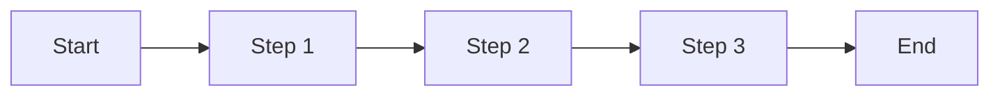
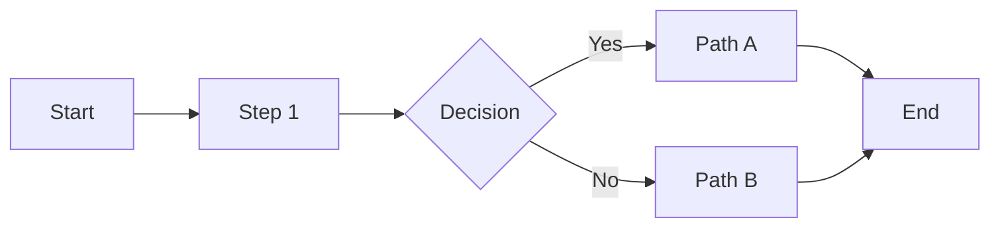
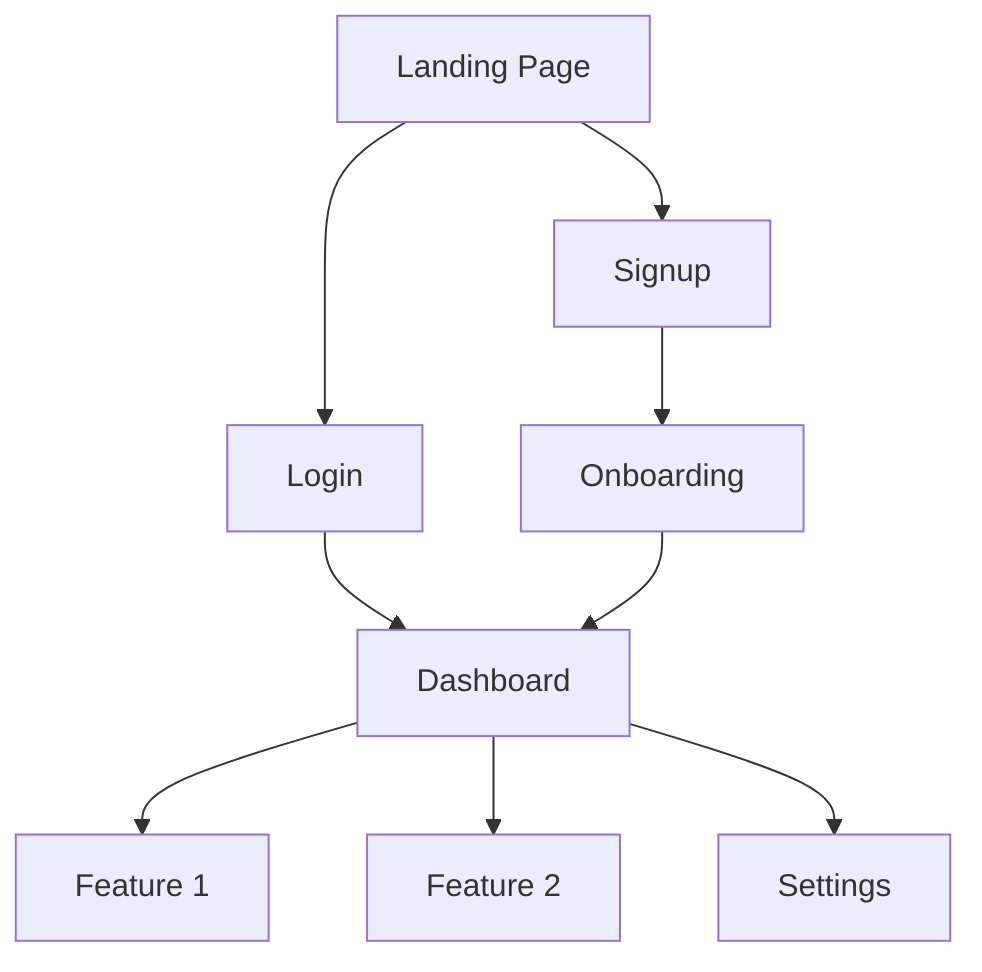
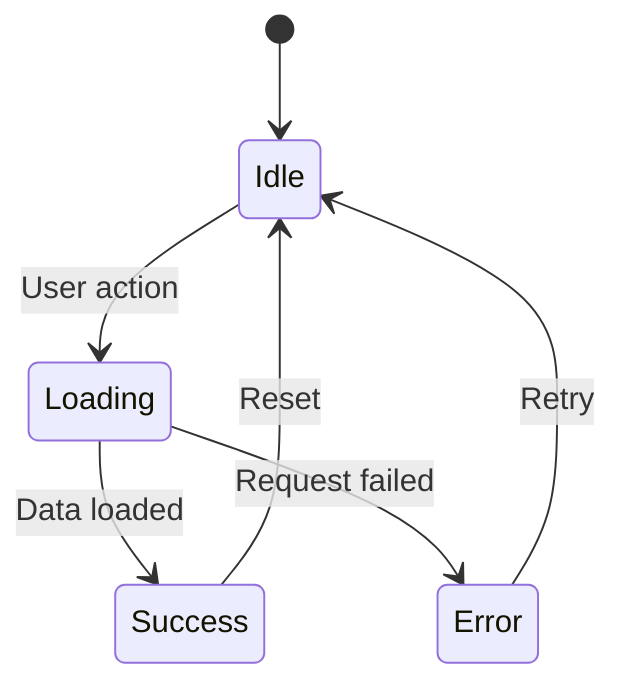

# Application Flow

## User Journeys

### Journey 1: [Name]
**Actor:** [User type]
**Goal:** [What they want to accomplish]

**Steps:**
1. [Step description]
2. [Step description]
3. [Step description]

**Success Criteria:**
- [Criterion 1]
- [Criterion 2]

---

### Journey 2: [Name]
**Actor:** [User type]
**Goal:** [What they want to accomplish]

---

## Screen Flow

---

## State Diagram

---

## Error Flows

### [Error Type 1]
**Trigger:** [What causes this]
**User Experience:** [What user sees]
**Recovery:** [How to recover]
