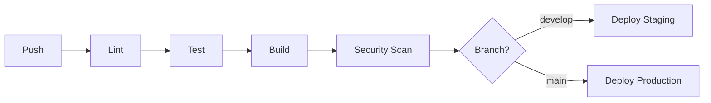

# CI/CD Pipeline Documentation

## Pipeline Overview



---

## Triggers

| Event | Action |
|-------|--------|
| Push to develop | Deploy to staging |
| Push to main | Deploy to production (manual approval) |
| Pull Request | Run tests only |
| Tag | Create release |

---

## Jobs

### 1. Lint
- Check code formatting
- Run linter
- Fail on errors

### 2. Test
- Run unit tests
- Run integration tests
- Generate coverage report
- Fail if coverage < 80%

### 3. Build
- Build application
- Create Docker image
- Push to registry

### 4. Security Scan
- Scan dependencies
- Run SAST
- Fail on critical vulnerabilities

### 5. Deploy
- Deploy to environment
- Run smoke tests
- Notify team

---

## Environment Variables

| Variable | Description | Secret |
|----------|-------------|--------|
| DATABASE_URL | Database connection | Yes |
| API_KEY | External API key | Yes |
| NODE_ENV | Environment name | No |

---

## Secrets Management
- Secrets stored in [GitHub Secrets / Vault / AWS SSM]
- Rotated every [90] days
- Access logged

---

## Rollback Procedure

1. Identify the issue
2. Navigate to GitHub Actions
3. Find last successful deployment
4. Click "Re-run deployment"
5. Verify rollback successful

**Emergency Rollback:**
```bash
# Revert to previous tag
git revert HEAD
git push origin main
```

---

## Notifications

| Event | Channel |
|-------|---------|
| Deploy success | Slack #deploys |
| Deploy failure | Slack #alerts + PagerDuty |
| Security issue | Slack #security |
