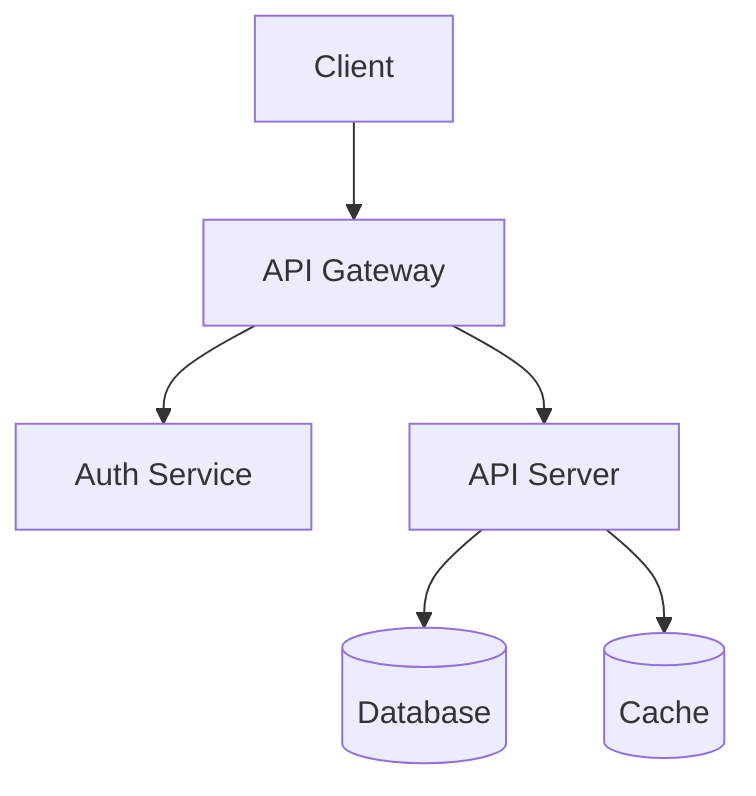
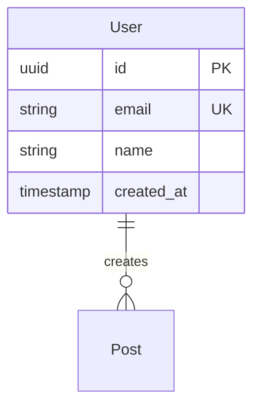

# System Architecture

## 1. Technology Stack

### Frontend
- **Framework:** [e.g., React, Vue, Next.js]
- **Rationale:** [Why this choice]

### Backend
- **Language:** [e.g., Node.js, Python, Go]
- **Framework:** [e.g., Express, FastAPI, Gin]
- **Rationale:** [Why this choice]

### Database
- **Primary:** [e.g., PostgreSQL, MongoDB]
- **Cache:** [e.g., Redis]
- **Rationale:** [Why this choice]

### Infrastructure
- **Cloud Provider:** [e.g., AWS, GCP, Azure]
- **Compute:** [e.g., ECS, Lambda, Cloud Run]

---

## 2. System Diagram

---

## 3. Data Model

---

## 4. API Design

### Base URL
- Production: `https://api.example.com/v1`

### Authentication
- Type: Bearer Token (JWT)

### Endpoints

| Method | Endpoint | Description |
|--------|----------|-------------|
| POST | /auth/register | Register new user |
| POST | /auth/login | User login |
| GET | /users/me | Get current user |

---

## 5. Decision Log

| Date | Decision | Rationale |
|------|----------|-----------|
| [Date] | [Decision] | [Why] |
