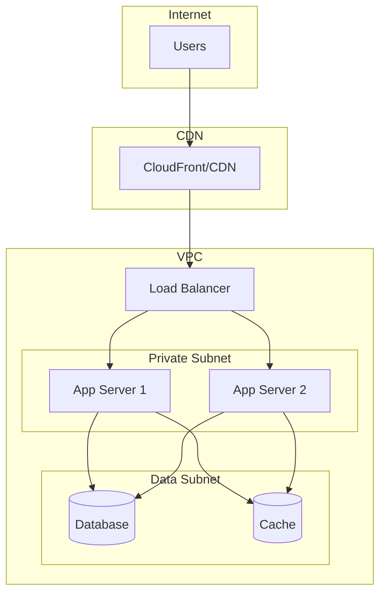

# Infrastructure Design

## Cloud Provider
**Provider:** [AWS / GCP / Azure]
**Region:** [Primary region]
**Backup Region:** [DR region]

---

## Architecture Diagram

---

## Services

| Service | Provider Service | Purpose |
|---------|------------------|---------|
| Compute | [ECS/EKS/Lambda] | Application hosting |
| Database | [RDS/Aurora] | Data storage |
| Cache | [ElastiCache] | Session/data cache |
| Storage | [S3] | File storage |
| CDN | [CloudFront] | Static assets |
| DNS | [Route53] | Domain management |

---

## Environments

| Environment | Purpose | URL |
|-------------|---------|-----|
| Development | Active development | dev.example.com |
| Staging | Pre-production testing | staging.example.com |
| Production | Live environment | example.com |

---

## Scaling Strategy

### Horizontal Scaling
- Min instances: 2
- Max instances: 10
- Scale-up threshold: CPU > 70%
- Scale-down threshold: CPU < 30%

### Database Scaling
- Read replicas: [Number]
- Connection pooling: [Yes/No]

---

## Backup Strategy

| Resource | Frequency | Retention |
|----------|-----------|-----------|
| Database | Daily | 30 days |
| File Storage | Continuous | 90 days |
| Config | On change | Indefinite |

---

## Cost Estimate

| Service | Monthly Cost |
|---------|--------------|
| Compute | $[amount] |
| Database | $[amount] |
| Storage | $[amount] |
| **Total** | **$[amount]** |
